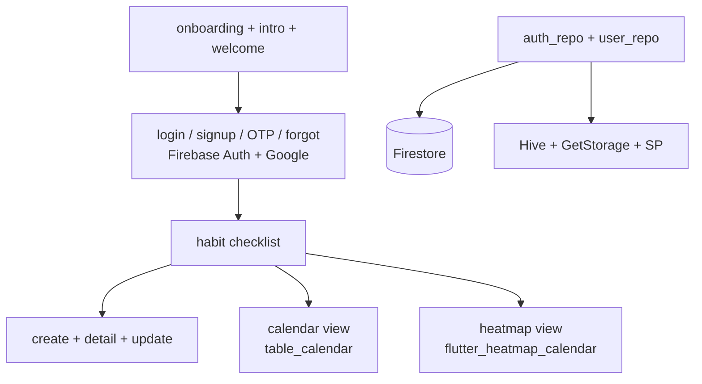
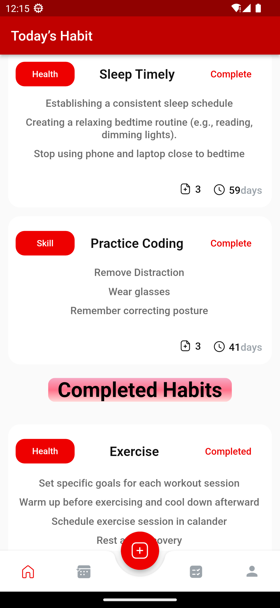
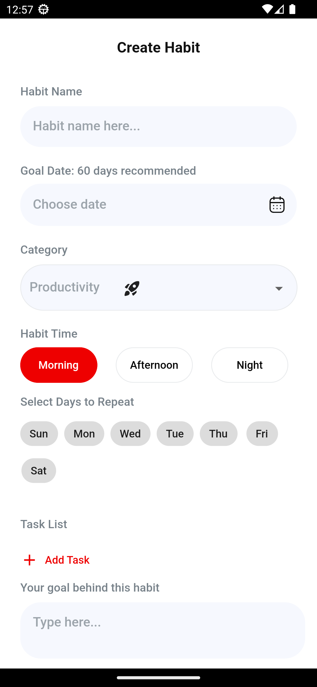
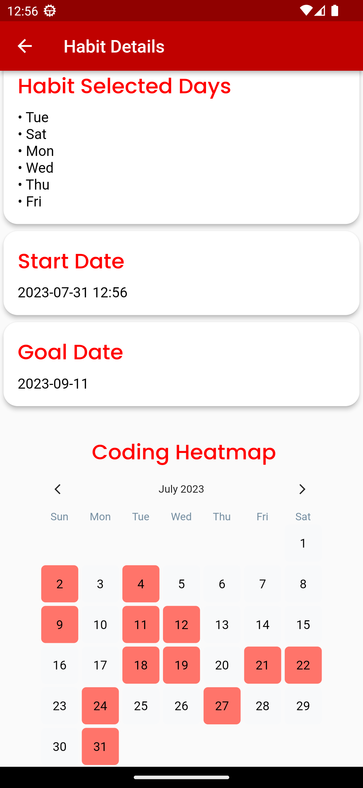
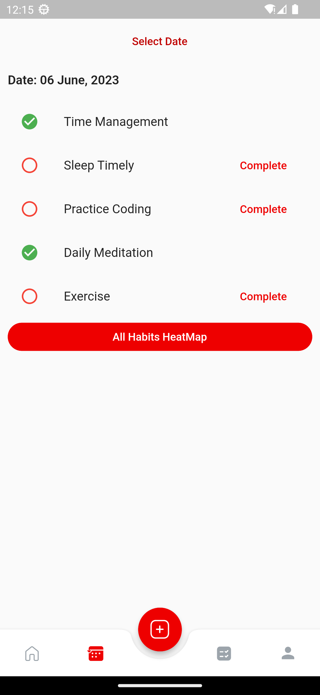
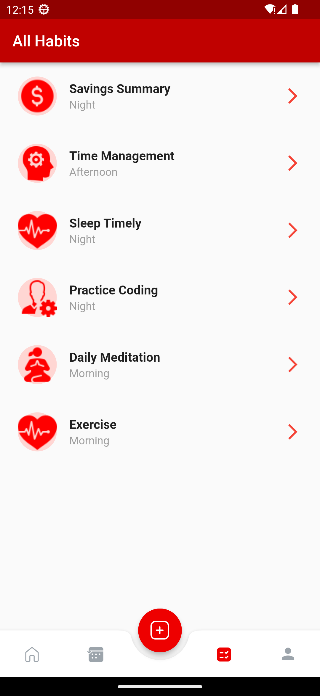
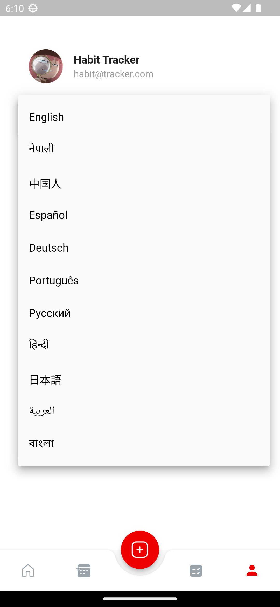

# Habit Tracker (Flutter)

> Offline-tolerant Android habit tracker with Firebase sync, heatmap streaks, and 11-language support.

**Stack:** Flutter (Dart `>=3.0.2 <4.0.0`) · GetX · Firebase Auth + Firestore · Hive + GetStorage + SharedPreferences · Table/Heatmap Calendar

| Fact | Evidence |
| --- | --- |
| 11 locales shipped | `localization/languages/` — en, es, de, ru, pt, ne, hi, ja, zh, bn, ar |
| Cloud truth + local cache | `getStorage → Firestore` migration for `lastOpenedDate` (commit `c9c20a8`); Hive/GetStorage/SP deps |
| Retention-first visuals | Checklist + calendar + heatmap screens; category art; animated gradients and "Completed" |
| 30 commits of solo iteration | Language bugs, delete-confirm guard, date-comparison fix, delight passes |

## The Problem

Habits die invisibly. Without visible streaks that survive offline days — and an app that speaks the user's language — a tracker gets abandoned within a week.

## The Solution

A GetX app where Firestore is the source of truth and Hive/GetStorage/SharedPreferences cache locally with connectivity awareness. Progress is reviewed two ways: a table calendar for scheduling and a heatmap for streak shame/pride. Auth spans email and Google; onboarding, OTP, and a CoC-style delete confirmation guard the flows that matter.



## Key Features

**Habit checklist with CRUD.** Create, detail, update, and guarded delete (explicit confirm). Why it matters: deletion is the one irreversible action — it deserves friction.

**Dual progress views.** Calendar for dates, heatmap for streaks. Why it matters: scheduling and motivation are different jobs; one view can't do both.

**11 languages.** Full localization set from English to Nepali to Arabic. Why it matters: habit apps are daily-use — language mismatch kills retention first.

**Firebase sync with local cache.** Firestore persistence with Hive/GetStorage caching and connectivity awareness. Why it matters: habits get logged on subways, not just on Wi-Fi.

**Onboarding flow.** Liquid-swipe intro plus welcome screens with category art. Why it matters: first-run comprehension decides day-two return.

## Key Engineering Decisions

**Problem → Constraint → Decision → Tradeoff → Result**

1. **Local date vs. cloud date diverged.** Constraint: device clocks and timezones make "today" ambiguous. Decision: moved `lastOpenedDate` from GetStorage to Firestore (`c9c20a8`). Tradeoff: a network read on the critical path. Result: one cloud definition of streak-day across devices.

2. **Localization bugs at scale.** Constraint: 11 locales multiply string/layout faults. Decision: dedicated language-bug passes (`b430ae5`) plus format normalization (habit status, `en_US`→English). Tradeoff: ongoing locale maintenance per feature. Result: a genuinely multilingual app, not a translated demo.

3. **Cache layering.** Constraint: no single local store fits session prefs, binary blobs, and reactive state. Decision: SharedPreferences + GetStorage + Hive together behind repository abstractions. Tradeoff: three cache APIs to maintain. Result: offline-tolerant reads with Firestore reconciliation.

## Iteration Story

Thirty commits: scaffold → auth repos → language waves (Japanese/Portuguese/Russian, then 9 more) → language-bug fixes → Firestore truth migration → delete-confirm guard → date-comparison fix → gradient/completion delight passes → README. Internationalization and correctness interleaved throughout — the mark of a real user-facing build.

## User Experience

Onboard through swipe intros, authenticate (email/Google/OTP), and land in the checklist. Create habits under categories with art, check them daily, and review streaks in the heatmap or dates in the calendar. Delete only after an explicit confirm. Everything works offline and syncs when connected.

## Results & Evidence

**Verifiable:** locale set, repo/cache layering, and the Firestore-truth migration all committed; 30-commit arc reviewable.

**Not claimed:** `test/widget_test.dart` is the default counter template — effectively no tests. No store listing or usage metrics are recorded; the APK is hosted on MediaFire (link above), not in-repo.

## Technical Details

| Area | Detail |
| --- | --- |
| Framework | Flutter, Dart `>=3.0.2 <4.0.0`, GetX navigation/state |
| Backend | `firebase_core` + `firebase_auth` + `cloud_firestore` + `google_sign_in` |
| Cache | `hive`/`hive_flutter`, `get_storage`, `shared_preferences`, `connectivity_plus` |
| UI | `table_calendar`, `flutter_heatmap_calendar`, `liquid_swipe`, `introduction_screen`, pin/OTP fields |
| Key files | `lib/main.dart`, `firebase_options.dart`, `src/features/authentication/`, `src/features/core/screens/`, `src/repository/` |
| Secrets | None via `.env` — Firebase through `flutterfire configure` (`firebase_options.dart` + `android/app/google-services.json`) |

## Setup

1. **Prerequisites:** Flutter SDK (Dart `>=3.0.2 <4.0.0`), Android Studio with SDK + emulator (or physical Android device), a Firebase account.
2. **Clone and install:**
   ```bash
   git clone https://github.com/LowkeyGud/Flutter-Habit_Tracker_Android.git
   cd Flutter-Habit_Tracker_Android
   flutter pub get
   ```
3. **Firebase:** run `flutterfire configure` to generate `lib/firebase_options.dart` and `android/app/google-services.json`.
4. **Run:**
   ```bash
   flutter run                # debug on device/emulator
   flutter run -d chrome      # web preview where supported
   flutter build apk --release
   ```
5. **Common issues:** missing `google-services.json` → build fails at Firebase init; project mismatch → regenerate via `flutterfire configure`; Gradle staleness → `flutter clean && flutter pub get`; empty heatmap → no completion records yet, not a bug.

No CI workflow is committed in this repo.

## Lessons / Takeaways

- Moving the streak clock to the cloud was the single most correctness-critical change — local time can't anchor retention.
- Eleven locales forced string discipline early; retrofitting i18n later would have cost far more.
- Next step is real widget tests and release-track deployment — the current suite is a placeholder.

## Links

- Repository: `https://github.com/LowkeyGud/Flutter-Habit_Tracker_Android`
- APK: `https://www.mediafire.com/file/17cqf153yxdfze9/habit-tracker.apk/file`

## Diagrams

Generated from the codebase with the mermaid-skill workflow (validate via Kroki → export SVG → vision self-check). Sources live in `docs/diagrams/` — edit the `.mmd`, re-render, review. SVG is the committed format.

**Habit flow** (`docs/diagrams/habit-flow.mmd` — onboarding, Firebase auth, repos, checklist/calendar/heatmap):



## Visuals

Screenshots from the app, recovered from the original attachments and vendored into `docs/screenshots/` (in-repo category art, onboarding illustrations, and splash screens also ship with the app):

<p align="center">






</p>
